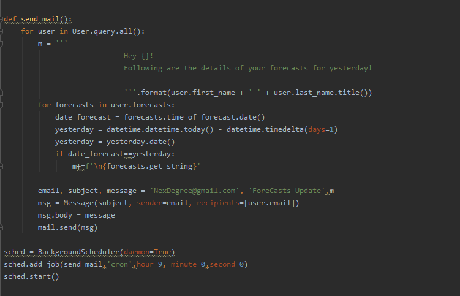

# NexDegree Weather Forecast

This is for tes.


## Installation

Install the libraries

```bash
  pip install -r requirements.txt
```

Simply run run.py


```bash
  python run.py
```

On the browser go to :

```bash
  http://127.0.0.1:5000/
```


## Demo


Signup / Signin Mechanisim


Get the user’s current location


Fetch the weather forecast for that particular location from Ope


Save the forecast in the database


Show an error message if the authenticated user is fetching the forecast for more than 3 times in
a span of 5 minutes


Send email to all registered users, with the records of their fetched forecast daily at 9AM from
the previous day.


